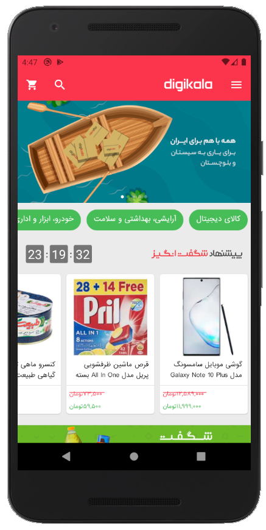
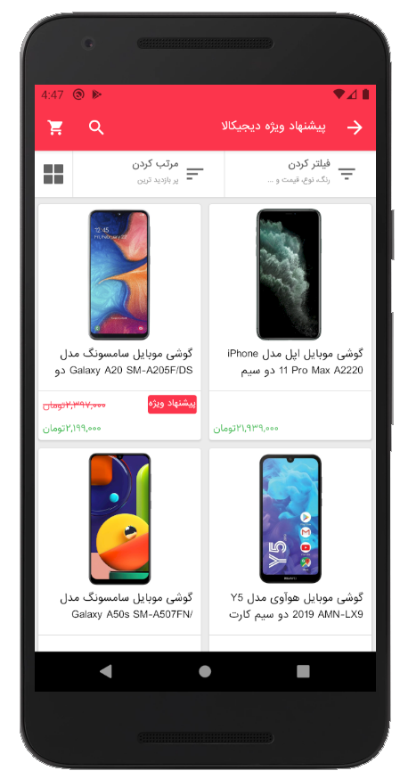
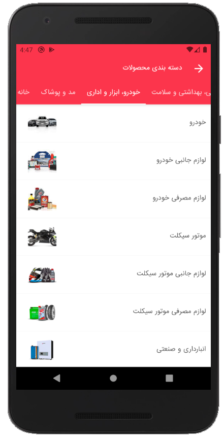
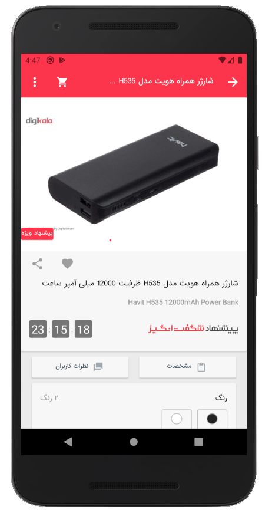

# Digikala
Digikala app is a online store and in this project implement the several section of that. this section is four page of digikala.

this secton is:
*  Main Page
*  List Page
*  Category Page
*  Product Page

   

#### Main Page :smiley:
this page has several banners and image slider for advertisment of the products and a timer for the show time of special offer to user. also contain of several list of the special products in specil category and show themain category in top of page.

complete: 100%

#### List Page :worried:
this page contain of list of several type of the products that's separate with several attribute for example price, views and etc.

complete: 80%

#### Category Page :heart_eyes:
this page show the all categories and sub categories. the category show on top of the page and sub categories show in list in fragment in center of page.

complete: 100%

#### Product Page :unamused:
this page is the very heavy and difficcult page in digikala :sob:. contains all information about a product and thats picture. also this page show the rate of the product and users vote for that product and user can see the number of the stores that's sell this product.

complete: 90%